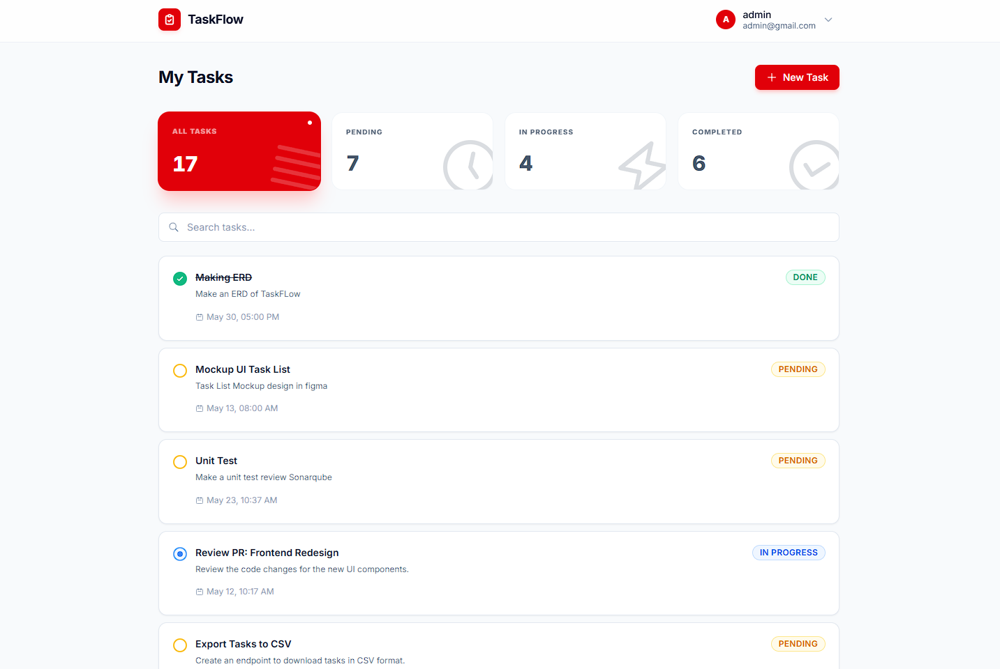
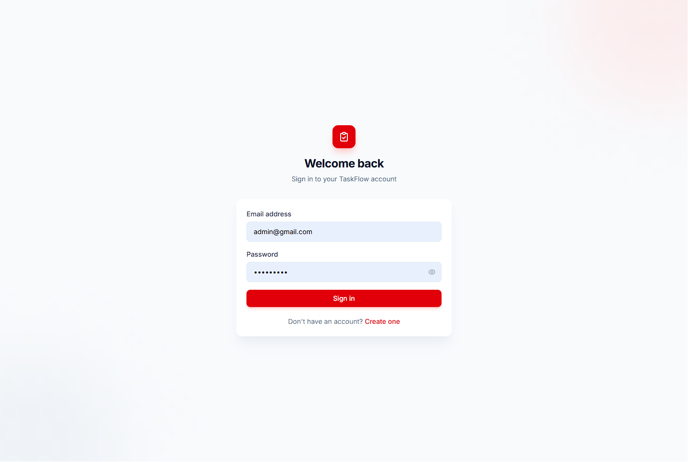

# TaskFlow

Fullstack task management system developed as a recruitment test case. This project demonstrates a clean architecture approach using Express.js (TypeScript) for the backend and Vue 3 for the frontend.

## Links

- **Live App:** [https://task-flow-fe-three.vercel.app](https://task-flow-fe-three.vercel.app)
- **API Docs:** [https://task-flow-be.onrender.com/api-docs/](https://task-flow-be.onrender.com/api-docs/)

## Key Features

- **JWT Authentication:** Secure user registration and login flow.
- **Task Management:** Full CRUD functionality for task entries.
- **Filtering & Search:** Real-time search by title and filtering by task status.
- **Backend Validation:** Data integrity ensured via Zod schema validation.
- **Interactive Docs:** Swagger/OpenAPI 3.0 integration for API testing.

## Tech Stack

### Backend
- Node.js & Express.js
- TypeScript
- MongoDB (Mongoose)
- Zod (Validation)
- Swagger (Documentation)
- Jest & Supertest (Unit/Integration Testing)

### Frontend
- Vue 3 (Composition API)
- Vite
- Pinia (State Management)
- Tailwind CSS
- Axios

## Project Structure

```text
.
├── backend/
│   ├── src/
│   │   ├── controllers/  # Request handlers
│   │   ├── models/       # Mongoose schemas
│   │   ├── routes/       # API endpoints
│   │   ├── middleware/   # Auth & error handling
│   │   └── server.ts     # Entry point
│   └── tests/            # Jest test cases
└── frontend/
    ├── src/
    │   ├── components/   # Shared UI components
    │   ├── views/        # Page components
    │   ├── stores/       # Pinia stores
    │   └── assets/       # Styles & static files
```

## Local Development

### 1. Backend Setup

1.  **Enter directory:**
    ```bash
    cd backend
    ```
2.  **Install:**
    ```bash
    npm install
    ```
3.  **Environment Variables:**
    Create a `.env` file from `.env.example`:
    ```bash
    cp .env.example .env
    ```
    Required keys: `MONGODB_URI`, `JWT_SECRET`, `CORS_ORIGIN`.
4.  **Run:**
    ```bash
    npm run dev
    ```
    API documentation will be available at `http://localhost:5000/api-docs`.

### 2. Frontend Setup

1.  **Enter directory:**
    ```bash
    cd frontend
    ```
2.  **Install:**
    ```bash
    npm install
    ```
3.  **Environment Variables:**
    Create a `.env` file from `.env.example`:
    ```bash
    cp .env.example .env
    ```
    Set `VITE_API_BASE_URL` to your local backend (default: `http://localhost:5000/api`).
4.  **Run:**
    ```bash
    npm run dev
    ```

---

## 🐳 Docker Deployment (Recommended)

The easiest way to run the entire stack is using Docker Compose.

1.  **Environment Variables:**
    Ensure you have a `.env` file in the root directory with the following variables:
    ```env
    MONGODB_URI=your_mongodb_uri
    JWT_SECRET=your_jwt_secret
    ```
2.  **Run with Compose:**
    ```bash
    docker-compose up --build
    ```
3.  **Access the app:**
    - Frontend: `http://localhost:3000`
    - Backend API: `http://localhost:5000`
    - API Docs: `http://localhost:5000/api-docs`

---

## 🧪 Testing

Run backend tests:
```bash
cd backend
npm test
```

## Screenshots

| Dashboard | Login |
| :---: | :---: |
|  |  |
